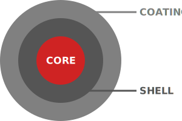

Library to create SVG visualisations for nano materials.

[](https://npmjs.org/package/nanoviz-svg)

[](https://standardjs.com)

## Install

    npm install nanoviz-svg

## Use

```js
const nanoviz = require('nanoviz-svg')

const svg = new nanoviz.nanoMaterial([
  {label: 'CORE'},
  {label: 'SHELL'},
  {label: 'COATING'}
], 'grey')
```

### `nanoviz.nanoMaterial`



Create an SVG with three parts, a core, a shell and a coating.

```ts
nanoviz.nanoMaterial(Array<Object> parts, (Array<Object>|Object|String|null) style)
```

  * `parts`: an array of objects
    * `part`: object with mandatory property label
  * `style`: a string denoting one of the built-in styles, an object extending an existing style, or a list of parts
    * `partStyle`: object with the following properties:
      * `color`: fill color
      * `textColor`
      * `striped`: whether the circle is striped
      * `radius`: radius of the circle (0 - 100)
      * `text`: pair of coordinates where the label should be (x: -100 - 200; y: -100 - 100); note that there is not much space
